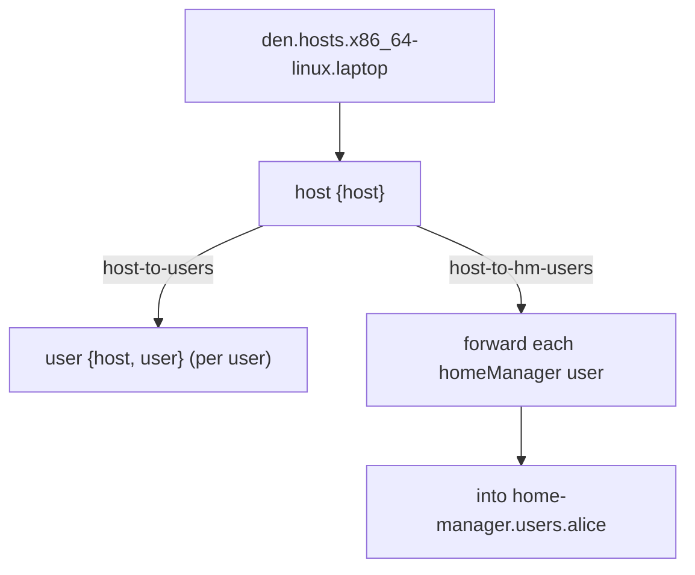

import { Steps, Aside } from '@astrojs/starlight/components';

<Aside title="Source" icon="github">
[`modules/policies/core.nix`](https://github.com/denful/den/blob/main/modules/policies/core.nix) --
[`modules/policies/flake.nix`](https://github.com/denful/den/blob/main/modules/policies/flake.nix) --
[`modules/aspects/defaults.nix`](https://github.com/denful/den/blob/main/modules/aspects/defaults.nix) --
[`nix/lib/home-env.nix`](https://github.com/denful/den/blob/main/nix/lib/home-env.nix) --
[`nix/lib/aspects/fx/pipeline.nix`](https://github.com/denful/den/blob/main/nix/lib/aspects/fx/pipeline.nix)
</Aside>

## Pipeline overview

When Den evaluates a host, it runs a **resolution pipeline** driven by
[policies](/explanation/policies/) and [entities](/explanation/entities/).
Policies are directed edges that fan context out to downstream entity kinds;
each entity kind binds behavior for its resolved context.



<Steps>
1. **Host resolution**

   For each entry in `den.hosts.<system>.<name>`, the pipeline creates a
   `host` scope. The host's own aspect is resolved via `den.schema.host.includes`,
   binding owned configs for the host's class.

2. **Core policy fans out to users**

   The one core traversal edge ([`modules/policies/core.nix`](https://github.com/denful/den/blob/main/modules/policies/core.nix))
   is `host-to-users`, registered as a `den.schema.host.includes` entry:

   | Policy | From | To | Resolve |
   |---|---|---|---|
   | `host-to-users` | `host` | `user` | One edge per `host.users` entry |

   A policy receives the current context and returns a list of downstream
   resolves. `host-to-users` fans out one `{ host, user }` pair per user
   declared on the host (via `resolve.shared`). If the host aspect has a
   freeform key matching a user's name, that sub-aspect is also included in
   the user scope.

   <Aside type="note">
   There are no longer `*-to-default` policies. `den.default` is injected as a
   [schema include](/explanation/entities/) for the `host`, `user`, and `home`
   entity kinds ([`modules/aspects/defaults.nix`](https://github.com/denful/den/blob/main/modules/aspects/defaults.nix)),
   so default aspects resolve automatically at each entity without a separate
   `default` traversal target.
   </Aside>

3. **Battery policies forward user environments**

   The home-environment batteries share a factory, `makeHomeEnv`
   ([`nix/lib/home-env.nix`](https://github.com/denful/den/blob/main/nix/lib/home-env.nix)),
   which produces a host-scope fan-out policy and a user-scope detect policy.
   The fan-out policy fires when the battery is enabled, the host OS is
   supported, and the host has at least one user of the battery's class:

   | Policy | Condition | Effect |
   |---|---|---|
   | `host-to-hm-users` | HM enabled, host has `homeManager`-class users | Forward each HM user into `home-manager.users.<name>` |
   | `hm-user-detect` | Per `homeManager`-class user | Apply user schema includes + forward |
   | `host-to-hjem-users` | hjem enabled, host has `hjem`-class users | Forward each user into `hjem.users.<name>` |
   | `hjem-user-detect` | Per `hjem`-class user | Apply user schema includes + forward |
   | `host-to-maid-users` | nix-maid enabled (NixOS), host has `maid`-class users | Forward each user into `users.users.<name>.maid` |
   | `maid-user-detect` | Per `maid`-class user | Apply user schema includes + forward |

   Rather than creating a two-stage `*-host` → `*-user` entity-kind chain, the
   fan-out policy resolves each matching user directly and emits a
   [forward](/explanation/effects/) into the target namespace. The battery's OS
   module (e.g. `home-manager.nixosModules.home-manager`) is imported once via a
   keyed module wrapper, so it fires a single time even when included from
   multiple user resolves.

   WSL is the exception: `host-to-wsl-host` ([`modules/aspects/batteries/wsl.nix`](https://github.com/denful/den/blob/main/modules/aspects/batteries/wsl.nix))
   does create a `wsl-host` entity kind (`resolve.to "wsl-host"`) when a NixOS
   host sets `wsl.enable`, importing the NixOS-WSL module into the host class.

4. **Deduplication**

   The pipeline tracks a seen set of include keys, each keyed by
   `"${scope}/${identityKey}"` (the current scope plus the aspect's identity).
   The first time a named aspect is included in a scope, the full aspect (owned
   configs + statics + parametric matches) is resolved. Subsequent includes of
   the same aspect in the same scope are skipped, so a shared aspect (e.g. one
   reachable from `den.default`) is not applied twice within a scope.

   Because the key is scope-prefixed, an aspect can still be included in
   *different* scopes — entity levels reached through different policies are
   isolated and each gets its own copy.

5. **Home configurations**

   Standalone `den.homes` entries follow a separate path. They are resolved by
   the flake policies (see step 6) rather than via a host, and their aspect
   resolves through `den.schema.home` includes:

   ```mermaid
   flowchart TD
     home["den.homes.x86_64-linux.alice"] --> homestage["home {home}"]
     homestage --> hmc["homeConfigurations.alice"]
   ```

   Home scopes have no `host` in context, so policies and provides requiring
   `{ host }` are not activated. Shared defaults still apply because `den.default`
   is one of the `home` schema includes.

6. **Output**

   Flake-level policies ([`modules/policies/flake.nix`](https://github.com/denful/den/blob/main/modules/policies/flake.nix))
   drive the final assembly. `flake-to-systems` fans out one `flake-system`
   scope per entry in `den.systems`. For each system, `system-to-os-outputs`
   resolves the declared hosts and `system-to-hm-outputs` resolves the
   standalone homes. Each entity is instantiated by its `instantiate` function
   (defaulting to `nixosSystem`/`darwinSystem` for hosts and
   `homeManagerConfiguration` for homes, depending on class) and placed at the
   entity's `intoAttr` path — `flake.nixosConfigurations`,
   `flake.darwinConfigurations`, or `flake.homeConfigurations`.

</Steps>

## See also

- [Entities and Schema](/explanation/entities/) -- what entities are and how they feed the pipeline
- [Policies](/explanation/policies/) -- how entities relate
- [Quirks & Pipes](/explanation/quirks-and-pipes/) -- structured data flow between aspects
- [Fleets & Multi-Host](/explanation/fleet/) -- cross-host resolution and data flow
- [Aspects](/explanation/aspects/) -- how entities resolve
