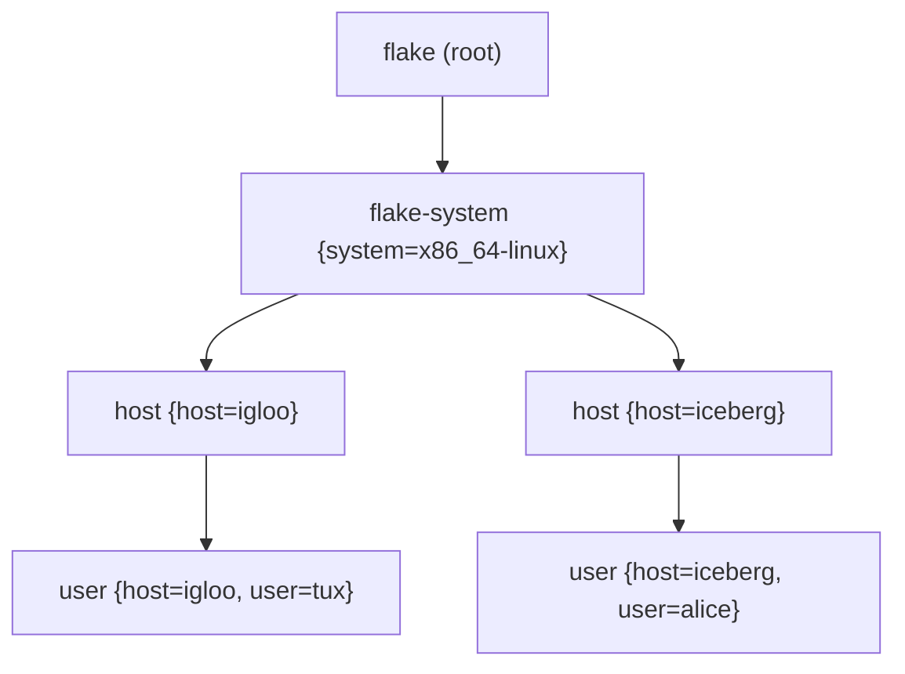
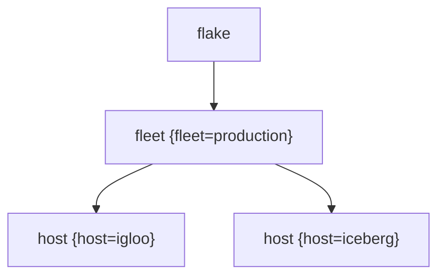

import { Aside } from '@astrojs/starlight/components';

<Aside title="Source" icon="github">
[`modules/policies/flake.nix`](https://github.com/denful/den/blob/main/modules/policies/flake.nix) --
[`nix/lib/aspects/fx/resolve.nix`](https://github.com/denful/den/blob/main/nix/lib/aspects/fx/resolve.nix) --
[`templates/ci/modules/public-api/pipe-scope.nix`](https://github.com/denful/den/blob/main/templates/ci/modules/public-api/pipe-scope.nix)
</Aside>

## What is a fleet?

A **fleet** is the set of hosts resolved together in a single pipeline
run. All hosts declared in a Den flake form a fleet automatically —
they become sibling scopes in a shared scope tree, and `pipe.collect`
can reach across them for cross-host data flow.

## The scope tree

Every entity in the pipeline gets a scope. Scopes form a tree rooted at
the flake:



The built-in flake policies drive this tree:

| Policy | Effect |
|---|---|
| `flake-to-systems` | Creates a `flake-system` scope per system in `den.systems` |
| `system-to-os-outputs` | Creates a `host` scope per host, plus an instantiate request |
| `system-to-hm-outputs` | Creates a `home` scope per standalone home |
| `host-to-users` | Creates a `user` scope per user on each host |

All hosts of the same system are **siblings** — they share the same
`flake-system` parent scope. This is the key relationship that enables
`pipe.collect`.

## Cross-host data flow

The simplest cross-host pattern: every host produces some data, and every
host (or a specific host) consumes the aggregated result.

### Example: load balancer backends

```nix
# Declare the quirk
den.quirks.http-backends = {
  description = "HTTP backend endpoints";
};

# Each host produces its backend info
den.aspects.iceberg = {
  http-backends = { addr = "10.0.0.2"; port = 80; };
};
den.aspects.igloo = {
  http-backends = { addr = "10.0.0.1"; port = 8080; };
};

# Collect policy: each host sees all hosts' backends
den.policies.fleet-backends = { host, ... }:
  let inherit (den.lib.policy) pipe; in
  [ (pipe.from "http-backends" [
      (pipe.collect ({ host, ... }: true))
    ])
  ];

den.schema.host.includes = [ den.policies.fleet-backends ];

# Consumer aspect
den.aspects.haproxy = {
  nixos = { http-backends, lib, ... }: {
    services.haproxy.config = lib.concatMapStringsSep "\n"
      (b: "server ${b.addr} ${b.addr}:${toString b.port}")
      http-backends;
  };
};

den.aspects.igloo.includes = [ den.aspects.haproxy ];
```

The `igloo` host sees `http-backends` containing entries from both itself
and `iceberg`.

### How `pipe.collect` works

`pipe.collect` receives a predicate that filters sibling scopes.
Siblings are scopes sharing the same parent in the scope tree. The
predicate receives each sibling's context attrset.

```nix
# Collect from all host siblings
pipe.collect ({ host, ... }: true)

# Collect only from hosts named "web-*"
pipe.collect ({ host, ... }: lib.hasPrefix "web-" host.name)
```

Entity kind filtering is automatic: required args in the predicate
(`host` in these examples) are checked against schema entity kinds. Only
sibling scopes with matching entity kinds are considered — user scopes
won't match a `{ host, ... }` predicate.

### Filtering collected data

Transform stages after `pipe.collect` operate on the combined pool:

```nix
pipe.from "http-backends" [
  (pipe.collect ({ host, ... }: true))
  (pipe.filter (b: b.port != 8080))
]
```

### Tracking provenance

Use `pipe.withProvenance` to know which host each entry came from:

```nix
den.policies.fleet-backends = { host, ... }:
  let inherit (den.lib.policy) pipe; in
  [ (pipe.from "http-backends" [
      (pipe.collect ({ host, ... }: true))
      pipe.withProvenance
    ])
  ];
```

Consumers receive `{ value; source; }` records where `source` is the
full context attrset of the originating scope:

```nix
den.aspects.haproxy = {
  nixos = { http-backends, lib, ... }: {
    services.haproxy.config = lib.concatMapStringsSep "\n"
      (entry: "server ${entry.source.host.name} ${entry.value.addr}:${toString entry.value.port}")
      http-backends;
  };
};
```

## Config-dependent cross-host data

Quirk values can depend on a host's evaluated NixOS config. For
cross-host collection, these thunks are resolved eagerly against the
source host's instantiated config:

```nix
den.aspects.webserver = {
  nixos.services.nginx.enable = true;
  http-backends = { config, host, ... }: {
    addr = host.name;
    port = config.services.nginx.defaultHTTPListenPort;
  };
};
```

When `igloo` collects this via `pipe.collect`, the thunk runs against
`iceberg`'s evaluated NixOS config, producing the correct port value.

<Aside type="caution">
The dependency graph of config-dependent cross-host thunks must be a DAG.
If host A's thunk reads host B's config, and host B's thunk reads host A's
config, Nix will hit infinite recursion.
</Aside>

## Fleet entity grouping

By default, all hosts of the same system are siblings under
`flake-system`. If you need a different grouping — for example,
splitting hosts into production and staging fleets — you can define
a fleet entity:

```nix
# Define a fleet policy that groups hosts under a parent scope
den.policies.to-fleet = _: [
  (den.lib.policy.resolve.to "fleet" {
    fleet = { name = "production"; };
  })
];

den.policies.fleet-to-hosts = { fleet, ... }:
  lib.concatMap (system:
    lib.concatMap (hostName:
      let host = den.hosts.${system}.${hostName}; in
      [ (den.lib.policy.resolve.to "host" { inherit host; })
        (den.lib.policy.instantiate host)
      ]
    ) (builtins.attrNames (den.hosts.${system} or {}))
  ) (builtins.attrNames (den.hosts or {}));

den.schema.flake.includes = [ den.policies.to-fleet ];
den.schema.fleet.includes = [ den.policies.fleet-to-hosts ];
```

This creates the scope tree:



Now hosts are siblings under the fleet scope rather than under
`flake-system`, and `pipe.collect` sees them as peers.

<Aside>
The `fleet` entity kind is pre-registered in `den.schema` — you don't
need to declare it yourself. The built-in schema includes
`fleet = {}` alongside `host`, `user`, and `home`.
</Aside>

## Upward flow: user data to host

User-scope data reaches the host via `pipe.expose`. This is orthogonal
to fleet patterns but composes with them:

```nix
# User produces preferences
den.aspects.tux = {
  prefs = [{ editor = "vim"; }];
};

# Expose policy pushes user data to host scope
den.policies.expose-prefs = { host, user, ... }:
  let inherit (den.lib.policy) pipe; in
  [ (pipe.from "prefs" [ pipe.expose ]) ];

den.default.includes = [ den.policies.expose-prefs ];

# Host consumer sees all users' preferences
den.aspects.host-config = {
  nixos = { prefs, lib, ... }: {
    environment.etc."editors.txt".text =
      lib.concatMapStringsSep "\n" (p: p.editor) prefs;
  };
};
```

Exposed and local data merge: if the host also emits `prefs`, consumers
see both.

## Walk-then-instantiate

All hosts resolve in a single pipeline walk. After the walk completes,
per-host assembly extracts each host's subtree from the shared state:

1. **Walk** — the pipeline walks all entities (flake → systems → hosts →
   users), collecting aspects, pipe data, routes, and instantiate
   requests into scope-partitioned state.
2. **Pipe assembly** — `assemblePipes` runs post-walk, merging exposed
   data and applying pipe effects. Cross-host `pipe.collect` reads
   directly from sibling scopes' already-walked data.
3. **Per-host extraction** — `applyInstantiates` filters the shared
   state to each host's subtree (the host scope + its descendants +
   ancestor scopes like `flake-system` whose routes and provides must
   remain visible), then re-runs class wrapping, provides, and routes
   with the host as the root scope.
4. **Instantiation** — each extracted subtree is passed to
   `lib.nixosSystem`, `darwinSystem`, or `homeManagerConfiguration`.

This architecture means `pipe.collect` always sees all hosts' data —
there's no walk-order sensitivity.

## See also

- [Quirks & Pipes](/explanation/quirks-and-pipes/) — how pipes work
- [Quirks guide](/guides/quirks/) — hands-on pipe examples including `pipe.collect`
- [Policies](/explanation/policies/) — the policy system driving fleet topology
- [Diagrams](/explanation/diagrams/) — fleet-level visualization via `diag.fleet.of`
