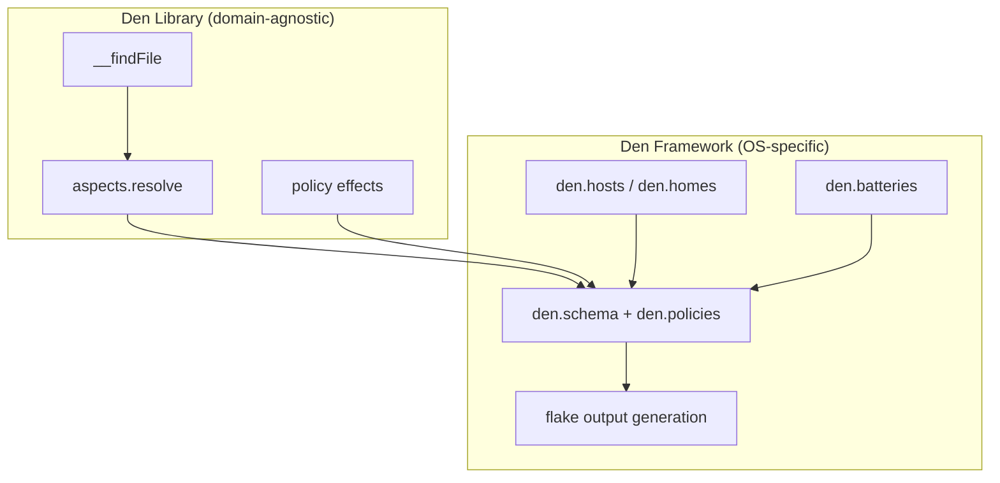

import { Aside } from '@astrojs/starlight/components';

## Den as a Library

Den's core (`nix/default.nix`) is domain-agnostic. `den.lib` exposes the
resolution pipeline (`aspects.resolve`/`aspects.resolveImports`), the typed
policy-effect constructors (`policy.*`), and `__findFile` for angle-bracket
(`<den/...>`) aspect paths. Nothing here assumes NixOS, Darwin, or Home Manager.

```nix
# `policy.*` is the shorthand; bring it into scope first.
inherit (den.lib) policy;

effects = [
  (policy.resolve.to "terranix" { env = "prod"; })
  (policy.include den.aspects.web-server)
];
```

See [`reference/lib`](/reference/lib/) for the full surface and signatures.

<Aside type="caution" title="Older helpers are deprecated">
Earlier releases exposed `den.lib.parametric` (`.atLeast`/`.exactly`/`.fixedTo`/`.expands`),
`den.lib.take`, and `den.lib.canTake` for manual context dispatch. The pipeline
now dispatches [parametric aspects](/explanation/parametric/) and wraps
[class modules](/explanation/class-modules/) automatically, so these are
deprecated. See [`reference/lib-deprecated`](/reference/lib-deprecated/).
</Aside>

## Using Den for Non-OS Domains

<Aside title="Source" icon="github">
[nix/default.nix](https://github.com/denful/den/tree/main/nix/default.nix)
</Aside>

Define aspects for any custom class, then resolve them into a module for that
class with `den.lib.aspects.resolve class aspect`:

```nix
# Aspects are plain attrsets; includes are bare functions that receive
# context. Dispatch is automatic — no parametric wrappers needed.
den.aspects.web-server = {
  terranix.resource.aws_instance.web.ami = "...";
  includes = [
    ({ env, ... }: { terranix.resource.aws_instance.web.tags.Env = env; })
  ];
};

# Resolve for your custom "terranix" class.
module = den.lib.aspects.resolve "terranix" den.aspects.web-server;
```

## Den as a Framework

On top of the library, Den provides `modules/` which implement:

- **Schema types** (`den.hosts`, `den.homes`) for declaring NixOS/Darwin/HM entities
- **Aspects & Policies** (`den.aspects`, `den.policies`) for the resolution pipeline
- **Batteries** (`den.batteries.*`) for common OS configuration patterns
- **Output generation** instantiating configurations into flake outputs (`nixosConfigurations`, `darwinConfigurations`, …)

The framework is entirely optional. You can use `den.lib` directly without
any of the `den.hosts`/`den.aspects` machinery.



## When to Use What

- **Library only**: You have a custom Nix module system (Terranix, NixVim, system-manager)
  and want parametric aspect dispatch without Den's host/user/home framework.
- **Framework**: You configure NixOS/Darwin/Home Manager hosts and want the full
  pipeline with batteries, schema types, and automatic output generation.
- **Both**: Use the framework for OS configs and the library for additional domains
  within the same flake.
