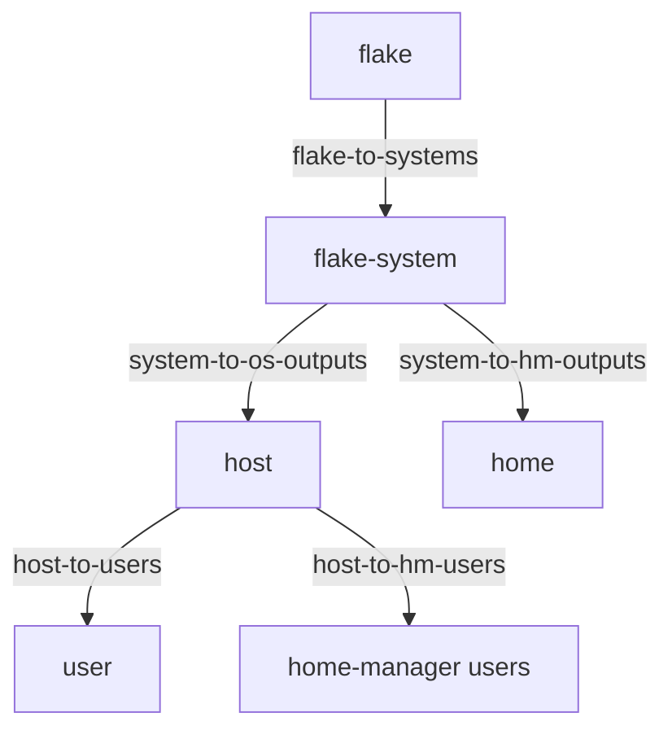

import { Aside } from '@astrojs/starlight/components';

<Aside title="Source" icon="github">
[`nix/lib/policy-effects.nix`](https://github.com/denful/den/blob/main/nix/lib/policy-effects.nix) --
[`modules/policies/core.nix`](https://github.com/denful/den/blob/main/modules/policies/core.nix) --
[`modules/policies/flake.nix`](https://github.com/denful/den/blob/main/modules/policies/flake.nix)
</Aside>

Policies are one of Den's core concerns.
Where [entities](/explanation/entities/) declare *what things are* and
[aspects](/explanation/aspects/) declare *what behavior applies*,
**policies** declare *how entities relate* — the directed edges
that connect entity kinds, enrich context, route content, and drive
structured data flow.

## What is a policy?

A policy is a function from context to a list of effects. The pipeline
calls it when all required context args are present:

```nix
let inherit (den.lib) policy; in
den.policies.host-to-users = { host, ... }:
  map (user: policy.resolve.to "user" { inherit host user; })
    (lib.attrValues host.users);
```

Policies are **first-class values** — they live in `den.policies` as a
registry, and are **activated** by including them in `includes` lists.

## The policy graph



Each arrow is a policy. The pipeline walks this graph at evaluation time:
starting from the root, it fires every active policy whose required args
match the current context, dispatches the returned effects, and recurses
into resolved targets.

## Writing a policy

A policy is a bare function that destructures the current context and
returns a list of [policy effects](/reference/policies/):

```nix
den.policies.my-enrichment = { host, ... }:
  let inherit (den.lib.policy) resolve; in
  [ (resolve { myFlag = true; }) ];
```

Policy effect constructors live under `den.lib.policy` — use
`let inherit (den.lib.policy) resolve; in` or access them directly as
`den.lib.policy.resolve`, `den.lib.policy.include`, etc.

The `{ host, ... }:` pattern means this policy fires only when `host` is
in context. Den introspects the function args and checks satisfaction
automatically.

### Effects, conceptually

Effects are the vocabulary a policy speaks. A few families cover most uses:
`resolve` (enrich the current scope or fan out a child entity), `include`
(inject an aspect to walk through the tree), `route` (move class content
between scopes), and `provide` (deliver a module straight to a class). There
are more — `exclude`, `instantiate`, `spawn`, and the `pipe` builder for
[quirks](/explanation/quirks-and-pipes/).

For the complete effect catalog — every constructor, variant, and its
`spec` shape — see the [policy effects reference](/reference/policies/#policy-effects).

### Enrichment vs entity resolution

`policy.resolve` behaves differently depending on what's in the bindings:

- **Entity keys** (keys matching `den.schema` kinds like `host`, `user`):
  creates a **child scope** and resolves a new entity. This is how
  `host-to-users` fans out — each user becomes a separate scope.
- **Non-entity keys**: **enriches** the current scope by merging new
  bindings into the context. No new scope is created. Deferred aspects
  that needed the new bindings are drained.

```nix
let inherit (den.lib) policy; in
# Enrichment — adds myFlag to current context, no new scope
policy.resolve { myFlag = true; }

# Entity resolution — creates a child "user" scope
policy.resolve.to "user" { inherit host user; }
```

This distinction matters: enrichment widens what aspects can resolve
in the current scope, while entity resolution creates an isolated
child scope with its own emissions.

### `policy.include` vs `policy.provide`

Both inject configuration, but through different paths:

| | `policy.include` | `policy.provide` |
|---|---|---|
| **Path** | Walks through the aspect tree | Bypasses the tree entirely |
| **Dedup** | Subject to include dedup | Deduped by policy/class/path |
| **Use when** | Injecting aspects that should participate in the full resolution (constraints, nested includes, parametric dispatch) | Delivering raw modules directly to a class when you don't need tree processing |

```nix
# include: the aspect is resolved through the tree
policy.include den.aspects.monitoring

# provide: the module goes straight to the class
policy.provide { class = "nixos"; module = { services.foo.enable = true; }; }
```

## Activation, in brief

Declaring a policy in `den.policies` only **registers** it. A policy fires
only once it appears in an `includes` list — globally
(`den.default.includes`), per entity kind (`den.schema.host.includes`), or
on a single aspect's subtree (`den.aspects.igloo.includes`). Symmetrically,
`excludes` prevents a policy from firing in a subtree, and parent excludes
are authoritative over child includes. The `policy.for` and `policy.when`
combinators gate a policy on a specific entity or a context predicate.

```nix
# register, then activate for all hosts
den.policies.my-enrichment = { host, ... }: [ /* effects */ ];
den.schema.host.includes = [ den.policies.my-enrichment ];
```

<Aside>
Built-in core policies are always active — they're activated via
`den.schema.*.includes` in `modules/policies/core.nix` and
`modules/policies/flake.nix`.
</Aside>

### Conditional policies

Two combinators gate *when* a policy fires, each preserving the inner
policy's identity (so `excludes` still matches the wrapped policy):

- `policy.for entity` — fire only when a specific entity is in context.
- `policy.when predicate` — fire only when a context predicate is true.

```nix
den.schema.host.includes = [
  (den.lib.policy.when ({ host, ... }: host.wsl.enable)
    den.policies.wsl-support)
];
```

This page covers the *concept*. For the full activation model — the
registry/value distinction, cascading across scopes, authoritative
exclude semantics, the `for`/`when` combinators, and the dispatch
fixed-point loop — see the
[Policy Activation Deep Dive](/explanation/policy-activation/).

## Relation to other concerns

1. **Data** ([Entities](/explanation/entities/)) defines what an entity *is*.
2. **Policies** (this page) define how entities *relate*, enrich context, and route data.
3. **Behavior** ([Aspects](/explanation/aspects/)) defines *how* entities resolve into configuration.

For the full API reference, see [den.policies reference](/reference/policies/).
For the complete activation/deactivation model, see [Policy Activation Deep Dive](/explanation/policy-activation/).
