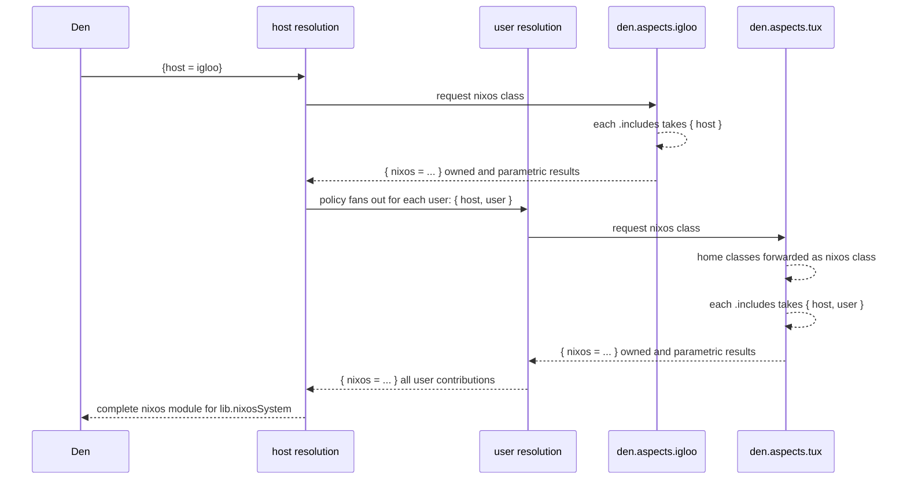
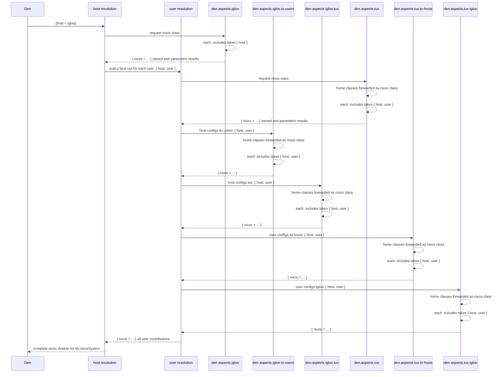

import { Aside } from '@astrojs/starlight/components';

## What Mutual-Config Mean

__Mutual Configs__ means that not only a User contributes
configuration to a Host, but **also** that a Host contributes
configurations to a User.

<Aside title="No battery required" type="tip">
Cross-entity routing is built into the pipeline — you do **not** need to enable
any battery. The `provides` keys below are translated into cross-entity policy
effects automatically. (`den.batteries.mutual-provider` still exists as an inert
compatibility shim so older configs that include it keep evaluating, but it
produces no effects.)
</Aside>


## Default, *unidirectional* OS configuration

Den's resolution pipeline starts with a host definition:

```nix "igloo" "tux"
den.hosts.x86_64-linux.igloo.users.tux = {}
```

We need to build the `nixos` Nix module that will later be used by `lib.nixosSystem`.
Policies drive entity topology — the built-in `host-to-users` policy fans out
from each host to its users:

> `Tip: Zoom diagrams using your mouse wheel or drag to move.`



This is the normal host resolution pipeline. All OS contributions come from the host itself and from each of its users.


## Providing across entities

To define mutual configurations, declare named aspects under an aspect's
`provides` namespace. Each `provides.<target>` key creates an explicit
relationship between a user and a host:

- `provides.<name>` delivers to the host or user named `<name>`.
- `provides.to-hosts` delivers to every host the user lives on.
- `provides.to-users` delivers to every user on the host.

```nix
# user aspect provides to a specific host or to all hosts where it lives
den.aspects.tux = {
  provides.igloo.nixos.programs.emacs.enable = true;
  provides.to-hosts = { host, ... }: {
    nixos.programs.nh.enable = host.name == "igloo";
  };
};

# host aspect provides to a specific user or to all its users
den.aspects.igloo = {
  provides.alice.homeManager.programs.vim.enable = true;
  provides.to-users = { user, ... }: {
    homeManager.programs.helix.enable = user.name == "alice";
  };
};
```

> `Tip: Zoom diagrams using your mouse wheel or drag to move.`



### Configuring peers from the host

A `provides` key registered on a *user* aspect is subtree-scoped: it reaches that
user (and the hosts it lives on), but **never** sibling users on the same host.
To configure several users — or to select per-user — register the `provides` on
the **host** aspect, whose subtree spans every user on it:

```nix
den.aspects.igloo = {
  # all users except tux get vim
  provides.to-users = { user, ... }: {
    homeManager.programs.vim.enable = user.name != "tux";
  };
  # only alice gets tmux
  provides.alice.homeManager.programs.tmux.enable = true;
};
```

### Standalone HomeManager - Host Specific Configuration

If you have two standalone homes sharing same user aspect, you can provide host specific
configuration even if the Host is not a NixOS system managed by you.

```nix
den.homes.x86_64-linux."tux@igloo" = {};
den.homes.x86_64-linux."tux@iceberg" = {};

den.aspects.tux = {
  homeManager.programs.vim.enable = true; # tux on ALL homes and hosts.

  provides.igloo = {
    homeManager.programs.helix.enable = true; # ONLY at igloo
  };

  provides.iceberg = {
    homeManager.programs.emacs.enable = true; # ONLY at iceberg
  };
};
```
