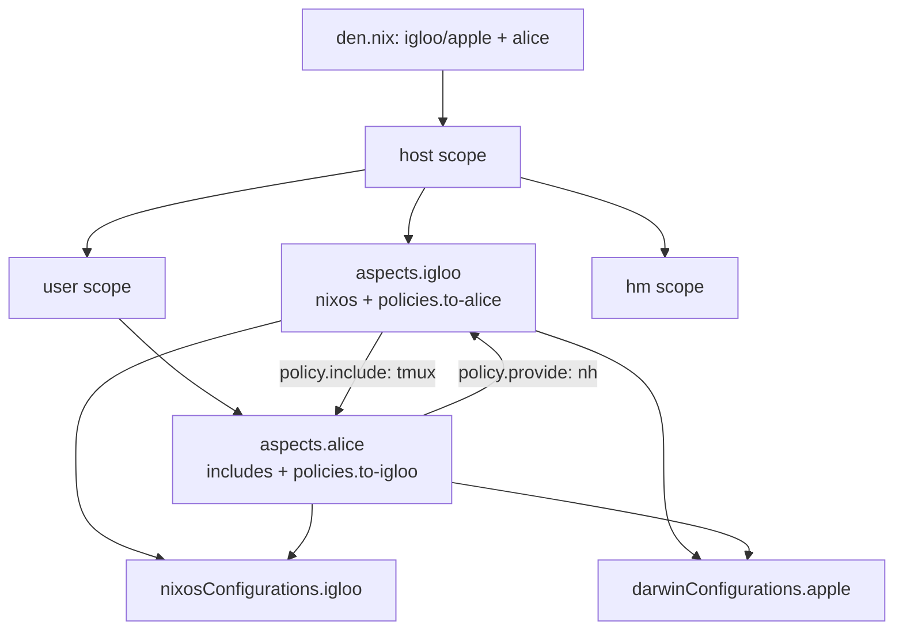

import { Aside } from '@astrojs/starlight/components';

<Aside title="Source" icon="github">
[`templates/example`](https://github.com/denful/den/tree/main/templates/example)
</Aside>

The example template demonstrates Den's advanced features: namespaces, angle brackets, cross-platform hosts, mutual providers, and custom aspect libraries.

## Initialize

```console
mkdir my-nix && cd my-nix
nix flake init -t github:denful/den#example
nix flake update den
```

## Project Structure

```
flake.nix
modules/
  den.nix              # host/home declarations
  dendritic.nix        # flake-file + den wiring
  inputs.nix           # flake inputs
  namespace.nix        # creates the "eg" namespace
  nh.nix               # exposes per-host/home build apps
  tests.nix            # CI checks
  vm.nix               # VM runner
  aspects/
    defaults.nix       # global config + angle brackets demo
    alice.nix          # user aspect
    igloo.nix          # host aspect
    eg/                # namespace aspects
      autologin.nix
      ci-no-boot.nix
      vm.nix
      vm-bootable.nix
      xfce-desktop.nix
```

## Key Features Demonstrated

### Cross-Platform Hosts

```nix
# modules/den.nix
{
  den.hosts.x86_64-linux.igloo.users.alice = { };
  den.hosts.aarch64-darwin.apple.users.alice = { };
  den.homes.x86_64-linux.alice = { };
}
```

One user (`alice`) across a NixOS host, a Darwin host, and a standalone Home-Manager config. The same aspects produce appropriate configs for each platform.

### Namespaces

```nix
# modules/namespace.nix
{ inputs, den, ... }:
{
  imports = [ (inputs.den.namespace "eg" true) ];
  _module.args.__findFile = den.lib.__findFile;
}
```

Creates a local namespace `eg` accessible as a module argument. The `true` flag exposes it as a flake output (`flake.denful.eg`). Angle brackets are enabled via `__findFile`.

### Namespace Aspects

The `eg/` directory defines reusable aspects under the `eg` namespace:

```nix
# modules/aspects/eg/vm.nix
{ eg, ... }:
{
  eg.vm = {
    gui.includes = [ eg.vm  eg.vm-bootable.gui  eg.xfce-desktop ];
    tui.includes = [ eg.vm  eg.vm-bootable.tui ];
  };
}
```

Aspects can have nested sub-aspects — `eg.vm.gui` and `eg.vm.tui` are children of `eg.vm`, selected by referencing them directly (e.g. `eg.vm.gui` in an `includes` list).

### Angle Brackets

```nix
# modules/aspects/defaults.nix
{ config, __findFile ? __findFile, den, ... }:
{
  den.default.includes = [
    <den/hostname>       # resolves to den.batteries.hostname
    <den/define-user>    # resolves to den.batteries.define-user
    # only on CI hosts:
    (if config ? _module.args.CI then <eg/ci-no-boot> else { })
  ];
}
```

The `<name>` syntax is shorthand for aspect lookup. `<den/define-user>` resolves to the `den.batteries.define-user` battery; `<eg/ci-no-boot>` resolves to the `ci-no-boot` aspect in the `eg` namespace. See [Angle Brackets](/guides/angle-brackets/).

### Mutual Providers

Hosts and users can contribute configuration **to each other** through aspect-included policies that emit `den.lib.policy` effects:

```nix
# modules/aspects/alice.nix — user delivers NixOS config TO the host
den.aspects.alice = {
  includes = [ den.aspects.alice.policies.to-igloo ];
  policies.to-igloo =
    { host, user, ... }:
    lib.optional (host.name == "igloo") (
      den.lib.policy.provide {
        class = "nixos";
        module.programs.nh.enable = true;
      }
    );
};

# modules/aspects/igloo.nix — host delivers Home-Manager config TO the user
den.aspects.igloo = {
  includes = [ den.aspects.igloo.policies.to-alice ];
  policies.to-alice =
    { host, user, ... }:
    lib.optional (user.name == "alice") (
      den.lib.policy.include {
        homeManager.programs.tmux.enable = user.name == "alice";
      }
    );
};
```

A `policies.<name>` entry is a context-aware function that fires once its argument signature (here `{ host, user, ... }`) is satisfied by scope context. `den.lib.policy.provide` delivers a typed module into a named class on the *other* entity, while `den.lib.policy.include` pulls config into the current scope. Alice enables `nh` on igloo (NixOS), and igloo enables `tmux` for alice (Home-Manager).

### Tests

```nix
# modules/tests.nix — verifies the template works
{
  checks."alice enabled igloo nh" = checkCond "alice.igloo" igloo.programs.nh.enable;
  checks."igloo enabled alice tmux" = checkCond "igloo.alice" alice-at-igloo.programs.tmux.enable;
}
```

## Data Flow



## What It Provides

| Feature | Provided |
|---------|:--------:|
| NixOS + Darwin hosts | ✓ |
| Home-Manager | ✓ |
| Standalone HM config | ✓ |
| Namespaces (`eg`) | ✓ |
| Angle brackets | ✓ |
| Mutual providers | ✓ |
| VM testing | ✓ |
| CI checks | ✓ |

## Next Steps

- Study the `eg/` namespace aspects as examples for your own libraries
- Read [Namespaces](/guides/namespaces/) and [Angle Brackets](/guides/angle-brackets/)
- Explore the [CI Tests template](/tutorials/ci/) for comprehensive feature coverage
