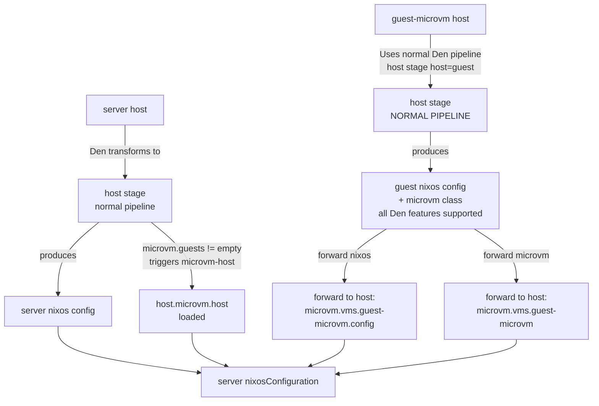

import { Aside } from '@astrojs/starlight/components';

<Aside title="Source" icon="github">
[`templates/microvm`](https://github.com/denful/den/tree/main/templates/microvm)
</Aside>

[templates/microvm](https://github.com/denful/den/tree/main/templates/microvm) demonstrates Den's extensibility: custom `den.schema` and `den.policies` extensions for integrating other Nix libraries like [MicroVM.nix](https://github.com/microvm-nix/microvm.nix).

This template shows two patterns for building MicroVMs with Den.

## Two MicroVM Patterns

### 1. Runnable MicroVM as Package

A standalone NixOS configuration that runs as MicroVM directly as an application.

- Den example: [runnable-example.nix](https://github.com/denful/den/tree/main/templates/microvm/modules/runnable-example.nix)
- Den support: [microvm-runners.nix](https://github.com/denful/den/tree/main/templates/microvm/modules/microvm-runners.nix)

```console
nix run .#runnable-microvm
```

See [MicroVM Docs on Package Runners](https://microvm-nix.github.io/microvm.nix/packages.html)

### 2. Declarative Guest VMs on Host

Guest MicroVMs declared on a host and managed together.

- Den example: [guests-example.nix](https://github.com/denful/den/tree/main/templates/microvm/modules/guests-example.nix)
- Den support: [microvm-integration.nix](https://github.com/denful/den/tree/main/templates/microvm/modules/microvm-integration.nix)

```console
nixos-rebuild build --flake .#server
```

See [MicroVM Docs on Declarative MicroVMs](https://microvm-nix.github.io/microvm.nix/declarative.html)

## Initialize

```console
mkdir my-nix && cd my-nix
nix flake init -t github:denful/den#microvm
nix flake update den
```

## Project Structure

```
flake.nix
modules/
  den.nix                      # Enable Den + hostname for all hosts

  runnable-example.nix         # Standalone NixOS MicroVM
  microvm-runners.nix          # Auto-expose runnable VMs as flake packages

  guests-example.nix           # Server host with declarative guest VMs
  microvm-integration.nix      # Schema extensions + context pipelines
```

## Key Features Shown

### Standalone Runnable MicroVM

Any runnable MicroVM with `declaredRunner` is auto-exposed as a flake package:

```nix
# modules/microvm-runners.nix
flake.packages = {
  x86_64-linux.runnable-microvm = <runner>;
};
```

### Schema Extensions for MicroVM Options

`microvm-integration.nix` extends `den.schema.host` with MicroVM-specific options
via `den.schema.host.imports`:

```nix
options.microvm.guests = lib.mkOption {
  type = lib.types.listOf lib.types.raw;
  default = [ ];
  description = "Guest MicroVMs. A list of Den hosts: [ den.hosts.x86_64-linux.foo-microvm ]";
};

options.microvm.sharedNixStore = lib.mkEnableOption "Auto share nix store from host";
```

### Host with Declarative Guests

```nix
# modules/guests-example.nix

# Server host with guest VM
den.hosts.x86_64-linux.server.microvm.guests = [
  den.hosts.x86_64-linux.guest-microvm
];

# Guest VM declaration (no top-level nixosConfiguration)
den.hosts.x86_64-linux.guest-microvm.intoAttr = [];

# Server config
den.aspects.server = {
  nixos.microvm.host.startupTimeout = 300;
};

den.aspects.guest-microvm = {
  # Den resolved and forwarded to `<host>.microvm.vms.guest-microvm.config`
  nixos = { pkgs, ... }: {
    environment.systemPackages = [ pkgs.cowsay ];
  };

  # Forwarded to `<host>.microvm.vms.guest-microvm`
  microvm.autostart = true;
};
```

### Custom Context Pipeline

The guest integration registers a custom `microvm` class and wires three policies
into the schema. Effect constructors come from `den.lib.policy`:

```nix
inherit (den.lib.policy) resolve include provide;

# Register the microvm class so guest aspects can emit `microvm` keys.
den.classes.microvm.description = "MicroVM guest configuration (microvm.nix options)";
```

Stage 1 — when a host declares guests, branch into a `microvm-host` context and
import the host.nix module inline:

```nix
den.policies.host-to-microvm-host =
  { host, ... }:
  lib.optionals (host.microvm.guests != [ ]) [
    (resolve.to "microvm-host" { inherit host; })
    (include (
      { host }:
      {
        ${host.class}.imports = [ host.microvm.hostModule ];
      }
    ))
  ];
```

Stage 2 — fan out one `microvm-guest` context per declared guest:

```nix
den.policies.microvm-host-to-microvm-guest =
  { host, ... }:
  lib.concatMap (vm: [
    (resolve.to "microvm-guest" { inherit host vm; })
  ]) host.microvm.guests;
```

Stage 3 — resolve each guest as an isolated host pipeline, then `provide` its
modules to the server at the right `microvm.vms.<name>` paths:

```nix
den.policies.microvm-guest-resolve-vm =
  { host, vm, ... }:
  let
    # Resolve VM as an isolated host pipeline — its modules stay external.
    vmResolved = den.lib.aspects.resolve vm.class (den.lib.resolveEntity "host" { host = vm; });
    microvmResolved = den.lib.aspects.resolve "microvm" vm.aspect;
  in
  [
    # Deliver VM's OS class modules to server at microvm.vms.<name>.config
    (provide {
      class = host.class;
      path = [ "microvm" "vms" vm.name "config" ];
      module = _: vmResolved;
    })
    # Deliver VM's microvm class modules to server at microvm.vms.<name>
    (provide {
      class = host.class;
      path = [ "microvm" "vms" vm.name ];
      module = _: microvmResolved;
    })
  ];
```

The policies are attached to their stages through the schema:

```nix
den.schema.host.includes = [ den.policies.host-to-microvm-host ];
den.schema.microvm-host.includes = [ den.policies.microvm-host-to-microvm-guest ];
den.schema.microvm-guest.includes = [ den.policies.microvm-guest-resolve-vm ];
```

## Data Flow



## What It Provides

| Feature | Provided |
|---------|:--------:|
| Custom context pipelines | ✓ |
| Schema extensions | ✓ |
| Forward providers | ✓ |
| Standalone runnable VMs | ✓ |
| Host-guest architecture | ✓ |
| Declarative MicroVM | ✓ |
| Auto nix store sharing | ✓ |

## Next Steps

- Read [MicroVM Documentation](https://microvm-nix.github.io/microvm.nix/)
- Check [Package Runners](https://microvm-nix.github.io/microvm.nix/packages.html)
- Explore [Host Configuration](https://microvm-nix.github.io/microvm.nix/host.html)
- Learn [Declarative VMs](https://microvm-nix.github.io/microvm.nix/declarative.html)
